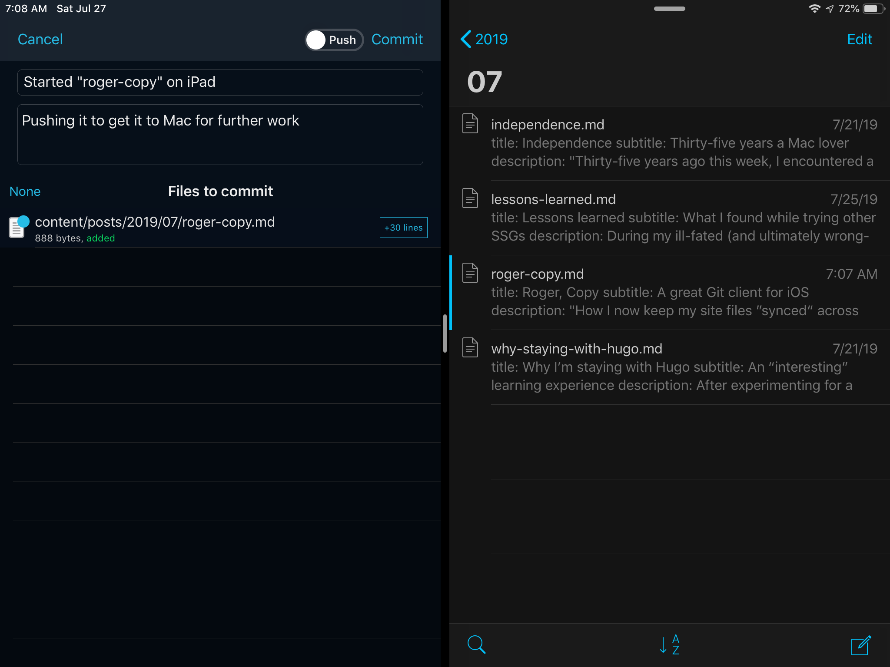
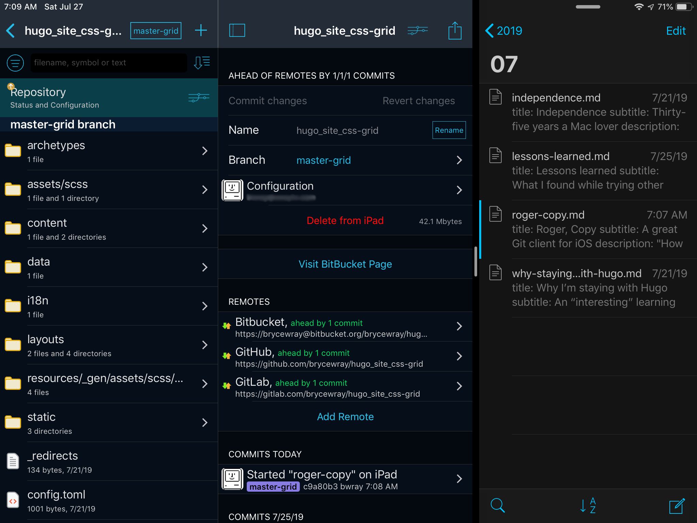
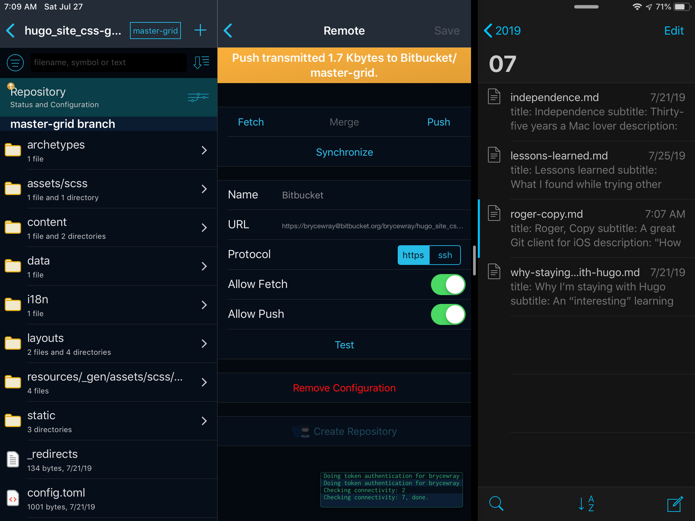
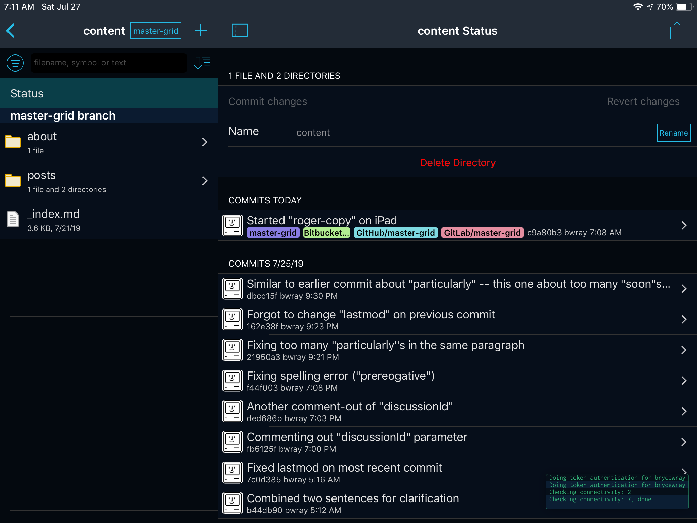
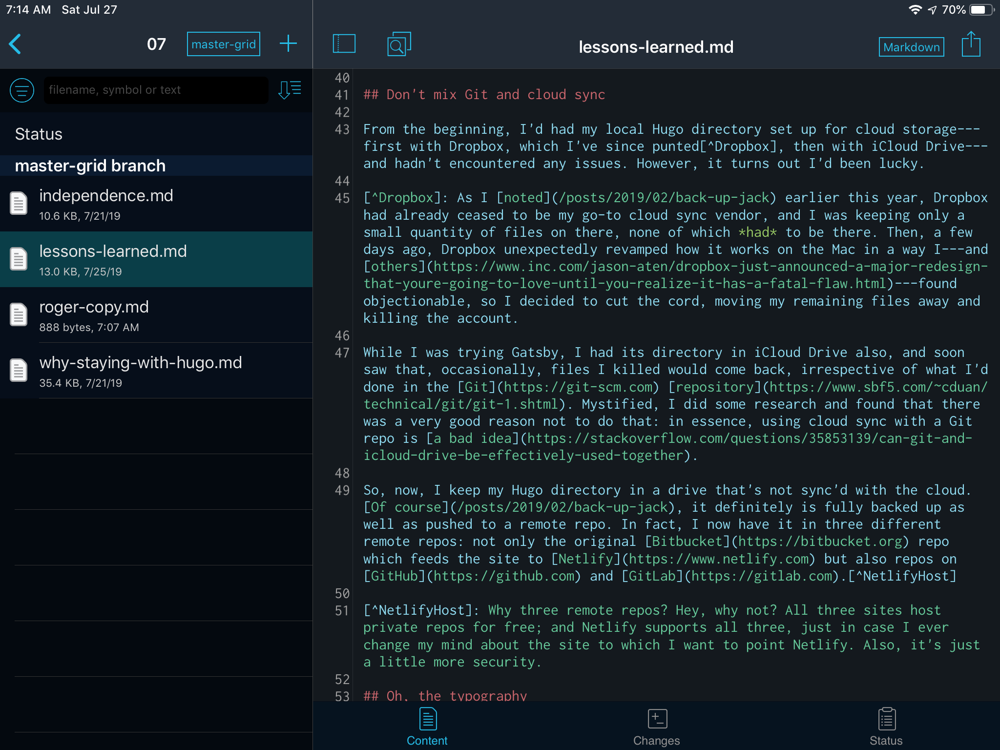

If this site had a horde of regular readers, there probably would be enough of you out there that, probability suggests, a tiny percentage could be expected to watch every change with eagle eyes.

That mythical group would have noticed that this site's footer changed twice in the last few days. First, something went away. Then, it came back.

In the footer, as you can plainly see, I credit the technologies on which I rely in maintaining this site. Up until a few days ago, I'd listed [iOS](https://www.apple.com/ios).

On July 21, I removed that reference.

On July 24, I brought it back.

The reason why the reference went away goes back to something from a [previous post](/posts/2019/07/lessons-learned/):

> .&nbsp;.&nbsp;.&nbsp;using cloud sync with a Git repo is [a bad idea](https://stackoverflow.com/questions/35853139/can-git-and-icloud-drive-be-effectively-used-together).  So, now, I keep my [SSG](https://staticgen.com) directory in a drive that's not sync'd with the cloud.

But, in giving up keeping this site's local [Git](https://git-scm.com) [repository](https://www.sbf5.com/~cduan/technical/git/git-1.shtml) in [iCloud Drive](https://developer.apple.com/icloud/icloud-drive/), I'd apparently also ceded one key advantage which cloud sync had provided: being able to write posts and manage my site from any of my iOS devices. Instead, it appeared, I was going back to the beginning, when I'd done it all from my iMac.

The reason I was able to bring back the reference is the subject of this post.

## A not-so-great "new normal"?

Going back to desktop-only handling of the site wouldn't have been a show-stopper. Still, I didn't care for the prospect.

After all, some of my more lucid moments and/or more accurate error-catching sessions come when I'm miles away from the Mac but within easy reach of my iPhone --- or even when I'm just in the living room, using the iPad in the wee hours of the morning before it's time to head out for the day.

While I'd had my repo in iCloud Drive, it had been easy to make edits and know that, once I got back to the Mac, the changed files would be there, waiting to be pushed to the online [Bitbucket](https://bitbucket.org) repo from which [Netlify](https://www.netlify.com) deploys this site.

So, simply, I didn't want to give that up just because I now knew it was unwise to keep a Git repo in cloud sync.

The answer was to treat each device as if it were a separate developer working on the same set of code and keeping it all straight in Git. No longer would the Mac-based repo be the only "source of truth," so to speak. Now, the full repo would actually have to be on each of my devices rather than just appearing to do so with iCloud Drive sync.

For that, I needed a good Git client on each of my iOS devices. Anything less would be not only counter-productive but also potentially data-destroying. (Yes, you can recover erroneous deletes and such with Git, but why not simply do it right the first time and thus minimize the need for that sort of "Holy [bleep]" moment?)

Fortunately, I'd been reading for months about the best iOS Git client: the justifiably popular [Working Copy](https://workingcopyapp.com). This app from Danish developer [Anders Borum](https://twitter.com/palmin) costs $16 with full capabilities[^remote] unlocked across your iOS devices. You can do a free trial of the full-power version for a few days; but, if your use case is anything close to mine, the $16 purchase --- plus about $9 every time a major revision comes out, generally once a year or so --- is an absolute no-brainer. This app is astoundingly solid. As far as I'm concerned, it stands miles above the competition.

[^remote]: The most notable example of what the paid version can do is pushing to a remote repo. In fact, this capability's being locked behind a paywall is probably the only reason this app gets a 4.9 rating on the App Store instead of a 5.0. But, once again I say: for what I want to do, it's a classic case of "Take my money."

## Copy that? Oh, yeah

The best way to learn about Working Copy is to read Borum's excellent [documentation](https://workingcopyapp.com/manual.html)[^docs] for the app, and you can check out its great reviews on the iOS App Store as well as articles like [this one](https://www.macstories.net/reviews/working-copy-integrates-with-the-files-app-and-drag-and-drop/) that show how many professionals swear by Working Copy. What I thought I'd do here is just give you a little sample of how I now use it to keep this site's Git repo straight among not only my devices but also my three remote repos on Bitbucket, [GitHub](https://github.com), and [GitLab](https://gitlab.com). Please understand that this is an *extremely simple* example of what Working Copy can do; check out that documentation and you'll get a much better idea.

[^docs]: After the awfulness of the [SSG](https://staticgen.com) documentation that I recently [attacked](/posts/2019/07/lessons-learned/), it was and is a distinct pleasure to use Working Copy's outstanding online manual.

Early this morning in the comfort of the living room recliner, I started this very post in [iA Writer](https://ia.net/writer) on the iPad. I put in some early front matter and a paragraph of text just to get started, and then I opened Working Copy and had both apps running in [split-screen mode](https://support.apple.com/en-us/HT207582). As you can see on the left, I'd started a Git commit of this article's original [Markdown](https://daringfireball.net/projects/markdown) file, `roger-copy.md`, highlighted on the right in iA Writer:

(I didn't have the **Push** slider activated because I have multiple remote repos and prefer to push to each manually; but, if you're using only one remote repo, you may find it more convenient to tap that slider so that each commit auto-pushes to the remote.)

Once I'd done the commit, I returned to the main display for the local repo, where it dutifully noted that each of the remote repos was now behind by that one new commit:

Please note that I wanted to push this Markdown file to Bitbucket and then the others, but obviously I *didn't* want this barely-started post to go live on the site; so I simply set the **date** parameter in the front matter to a future date. Then, when Netlify "saw" the change to the remote repo in Bitbucket, the resulting build process would ignore the new post as being not yet ready to go.[^draft]

[^draft]: You can achieve the same result --- purposely not publishing the post --- by just setting its **draft** parameter to *true* rather than *false*, but I prefer the "future date" method. It works better for my development purposes when I'm preparing upcoming posts, letting me see in a browser how they'll look.

So, this matter (pardon the pun) handled, I then pushed the commit --- first, to Bitbucket:

.&nbsp;.&nbsp;.&nbsp;and then to the others, so that soon the content status appeared as follows. Note that the master branch (*master-grid*) now was all sync'ed up with the three remote repos:

So I was all ready to go. Then all I had to do when I got back on the Mac was to use my [currently preferred macOS Git client](https://git-fork.com) to fetch the changes from Bitbucket, which instantly added this Markdown file to the Mac's version of the repo so I could work on it more. Incidentally, I could choose --- and have chosen --- to do text edits within Working Copy itself. Here you can see the Markdown file for my [last post](/posts/2019/07/lessons-learned/):

However, to Borum's credit, he [advises](https://workingcopyapp.com/manual/extending-ios) using a separate editor that's likely better suited to what a typical user wants, especially if that's involving code editing; so I also added [Textastic](https://www.textasticapp.com) to my iOS devices and have quickly learned it, too, is a great addition for one who wants to do as much site-editing in iOS as possible when necessary.

## Take the show on the road

So, in short: even though you shouldn't put your site's Git repo in cloud sync, you still can have the convenience and power of editing files when and where you need. Thanks to the superb features and stability of Working Copy, I can do that with ease from my iPad and iPhone. If your use case resembles mine at all, I strongly suggest you give Working Copy a serious look. It helps me keep my .git together, and I believe it will do the same for you.
