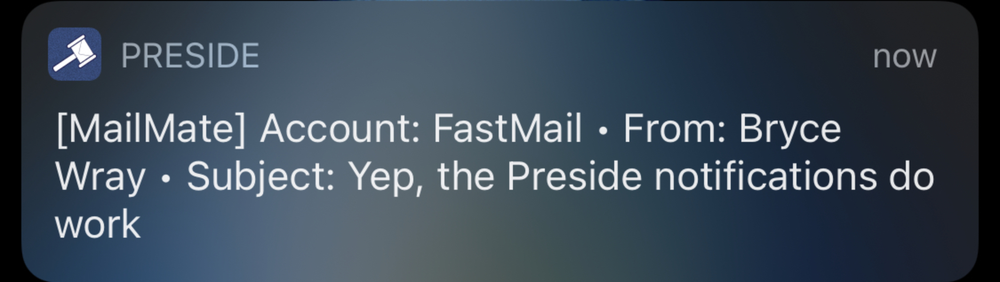

This is for all you power users who wield both the [MailMate](https://freron.com) Mac email app and [Preside](https://www.preside.io) iOS email app.

In my post, "[Battle of the iOS email heavyweights](/posts/2020/05/battle-ios-email-heavyweights/)," I noted that the only thing that rubbed me the wrong way about the otherwise excellent (and, indeed, amazing) Preside was its not-so-great handling of notifications. This is intended as a feature, not a bug. Preside's developer, [Rich Waters](https://github.com/richwaters), [believes](https://preside.io/faq.html#Notifications) email notifications impair one's productivity.[^UGvsFAQs]

[^UGvsFAQs]: Indeed, the [Preside User Guide](https://preside.io/userGuide.html) doesn't even mention notifications. For the official word on them, you have to go to the [Preside FAQs](https://preside.io/faq.html#Notifications).

Of course, Mr. Waters also understands that some people still really need (or, in my case, want) notifications as soon as possible and, so, he's provided some tools to make Preside handle notifications more as other email apps do. Still, each method has its drawbacks; but, fortunately, some tweaking will optimize what I consider to be the best of these methods.

So&nbsp;.&nbsp;.&nbsp;. **if** you have both MailMate and Preside and **if** you want not only notifications but *nearly instantaneous* notifications in Preside, read on.

## Methods, but not madness

First, understand that Preside's notification behavior, as is true for any email app, is based on which *synchronization method* it's using. Consider this analogy from snail mail: if you go outside to check your home's mailbox only once a day, that's how often you'll learn whether you have any mail in the box. Well, how often an email app "checks" your email accounts’ servers is what determines how snappily it can notify you of new emails.

As you can imagine, constantly syncing with the servers could be a battery-draining experience, so many third-party mobile email apps provide quick notifications by passively "listening" for "calls" from their respective vendors’ servers, which are constantly "watching" one's email accounts for new arrivals. Of course, this means those vendors have to have varying degrees of access to your email accounts, which many consider a violation of their privacy. To its great credit, Preside doesn't work that way.

Of the five synchronization methods Preside does offer, *private remote sync* is the only one that's relevant to the neat trick I'll be explaining shortly; so let's talk about it.

Private remote sync in Preside, which requires a free [preside.io account](https://preside.io/PremiumFAQ.html#PresideAccounts)[^premium], involves your using the [PresideNotify](https://github.com/richwaters/PresideNotify) tools in one of these three setups:

- A combination of the Mac's native Apple Mail app and [AppleScript](https://developer.apple.com/library/archive/documentation/AppleScript/Conceptual/AppleScriptLangGuide/introduction/ASLR_intro.html).
- A [Python](https://www.python.org/) script running on a remote server.
- A combination of the MailMate app and a *MailMate bundle* (see the [Mailmate bundle documentation](https://github.com/mailmate/mailmate_manual/wiki/Bundles)).

[^premium]: Don't confuse a preside.io account with the paid [Preside Premium](https://preside.io/PremiumFAQ.html) service. While you definitely will have a preside.io account with Preside Premium, you also can have a preside.io account without it, although its primary use with the free version of Preside is for the specific sync options that require it.

Of these three choices, the MailMate-specific one is what I'll be describing --- and amending --- in this post.

Here's some of what Preside's built-in documentation says of private remote sync in general:

> Use this option if you'd like to monitor your Inbox on your own desktop computer or server. When an email arrives, that computer can communicate with our servers to send the notification to your device. .&nbsp;.&nbsp;. The privacy implications are minimal with this mechanism. No account information is stored on our servers, and email information .&nbsp;.&nbsp;. passes through our servers [only] if you choose [for it] to do so. In that case, we don't do anything with the information other than to pass it through to your device.

In this scenario, you keep MailMate running all the time on your Mac --- if you're a MailMate user, I bet you do that anyway --- and set each of your email accounts to ping Preside, via a command within a PresideNotify MailMate bundle, whenever the account gets a new email.

The [MailMate-related instructions](https://github.com/richwaters/PresideNotify#mailmate--monitoring) in the PresideNotify README tell you what you need to know but, in my moderately humble opinion, are unnecessarily cryptic while also leaving out a couple of "nice-to-have" items. So allow me to give you my own version of the instructions for making this work with MailMate.

(While many MailMate users are avowed general-level techies and probably scoff at my concerns, some are strictly **email** power users rather than **overall** power users. It's this latter group for whom I think the original instructions may leave too much on the proverbial cutting-room floor. I grant you that the ones I've substituted herein are no walk in the park, either; but, in my view, the results are worth it.)

## The procedure

### Assumptions

- You understand that, in the following instructions, `{$User}` represents your user name on the Mac.
- You know how to use a terminal app **and** a [command-line text editor](https://support.apple.com/guide/terminal/use-command-line-text-editors-apdb02f1133-25af-4c65-8976-159609f99817/mac) such as vim or nano. *(If not, don't proceed. These instructions aren't all that hard to follow but, if you find a command-line interface daunting, Here Be Dragons.)*
- You have [Git](https://git-scm.com) installed on your Mac.
- You have a [preside.io account](https://preside.io/PremiumFAQ.html#PresideAccounts). You'll need to enter the user ID (probably an email address) and password, so have them ready.
- In Preside's **More** &gt; **Syncing &amp; notifications** settings:
	- You have set the **Background Sync** type to "Remote (private computer)."
	- You have enabled notifications, including with audio, and done so for Preside in iOS's own main Notifications settings, if necessary; if you haven't done so yet, setting it in Preside will prompt you to do it in iOS settings.
	- You have set "Manager" in **Remote Notifications** to "Remote."

Ready? Here we go.

### Steps

1. On your Mac, open the Finder. I highly suggest you select the "View as List" setting (**&#8984;**-**2**).

2. Navigate to:\
`{$User}`/Library/Application Support/MailMate/

3. If this location doesn't already have a "Bundles" folder in it, create one.

4. Navigate to that "Bundles" folder, so that you're now in:\
`{$User}`/Library/Application Support/MailMate/Bundles/

**Keep this Finder window open** while you perform the next steps.
{.indentAfterLI}

5. Open your chosen terminal app. If the app doesn't open at the `{$User}` level, execute the necessary command(s) to get to there.

6. In the terminal app, execute the following command, which will clone the PresideNotify repository into a "PresideNotify" folder at the top level of your `{$User}` folder:

git clone https://github.com/richwaters/PresideNotify.git PresideNotify


7. **Open another Finder window** --- remember to keep that first one open --- and navigate to:\
`{$User}`/PresideNotify/

8. In that folder, you'll see an item called "Preside.mmBundle," which is the MailMate bundle for PresideNotify. **Copy** it from **that** Finder window to `{$User}`/Library/Application Support/MailMate/Bundles/ in the **other** Finder window.

Although the Finder makes "Preside.mmBundle" appear to be a special sort of file, it's actually a folder, as the following few steps will make clear.
{.indentAfterLI}

9. Back in the terminal app, execute the following command to navigate to the necessary location for the next few steps (and the quotation marks **are** required):

cd "Library/Application Support/MailMate/Bundles/Preside.mmBundle/Support/bin/"


10. Execute `ls` and you should see a listing of one item: a shell script file called "preside_notify.sh."

11. Use your chosen command-line text editor to open this shell file. [Here is the original on GitHub](https://github.com/richwaters/PresideNotify/blob/master/Preside.mmBundle/Support/bin/preside_notify.sh), to which you may want to refer in the next few steps to keep the line numbering straight.

Because the original **doesn't** set Preside notifications to have any audio **and** doesn't tell you which of your (presumed-to-be) multiple accounts is providing a new email, we're going to fix that.
{.indentAfterLI}

12. On line 9, delete the opening `#` (which otherwise comments-out the line) so it reads as:

alertSound="GHSound_ChurchBell.mp3"


For a list of the available sounds you can use instead of that default one, see the [URL File Reference](https://github.com/richwaters/PresideNotify#url-reference). (I personally am partial to `GHSound_Piano1.mp3`, but to each their own.)
{.indentAfterLI}

13. Go down to line 68, which currently is:

msgTxt="${alertPrefix} From: ${fromStr}, Subject: ${MM_SUBJECT}"


This is the line which controls the "banner" text which you'll see on your iOS device screen when you get a notification.
{.indentAfterLI}

14. Edit the line so that it reads as follows:

msgTxt="${alertPrefix} Account: ${MM_ACCOUNT} • From: ${fromStr} • Subject: ${MM_SUBJECT}"


This will result in a notification message that tells you the sending account **and** separates the items nicely, since they'll appear on one text line. [You can just copy/paste that line **or**, to enter the bullet character on a Mac, hold down the **option** key (&#8997;) and press **8**.]
{.indentAfterLI}

15. Now, let's add a line that will **use** the "alert sound" in the first place. **After** line 77 (that's `--data-urlencode "ghEnableEmailActions=1" \`) but **before** line 79, add the following line:

--data-urlencode "alertSound=${alertSound}" \


16. You're done editing this file (as we revert to the developer's original instructions), so save it with its current name however the text editor lets you do that, and then exit the text editor. **Stay in the terminal app** and in this directory, because you have one more thing to do therein.

17. Execute the following line:

sh preside_notify.sh --setup


18. At the prompts, enter your preside.io account user name and password.\
**Now you're finished in the terminal app and in both Folder windows, all of which you can close if you want**.

19. If MailMate was open during all this, restart it. If it wasn't, start it now. Also, if Preside isn't already running on your iOS device, start it as well.

20. First, we'll test the notification process which that MailMate bundle will handle:
	- In MailMate, select any email.
	- Click **Commands** in the MailMate menu bar. You should see **Preside** among the options, thanks to that PresideNotify MailMate bundle you installed.
	- From it, select **SendNotification**. That should send a test notification --- complete with your chosen audio! --- to your Preside app.[^glitch]

[^glitch]: If the test notification failed, make sure you have notifications enabled for Preside. If you do, that means something went wacky above, so go back and make sure you didn't mistype something someplace. Remember that every character should be entered exactly as shown. Copy/paste is your friend.

21. **Last step**!\
In it, we'll enable the actual notification setting for each account. In MailMate's left sidebar, find the **Sources** list, which shows the accounts you've set up in MailMate. For *each* one:
	- Right-click or **control**-click it to get a popup menu, and select **Edit rules&#46;&#46;&#46;**
	- In the resulting window, click the **Rules** tab.
	- At the bottom of the window, tap the **+** to add a new rule. In the resulting popup:
		- Give the rule a useful **Description**.
		- Use the dropdown menus to set up the *conditions* under which the rule will do its thing. In my case, I went with "**All** of the following are true" and "Message is not Read"; you can play with it to suit your use case, but I'd suggest starting with this setup.
		- In the area which currently says "No actions added," click the **+** button to add an action; then, from the dropdowns, select **Run Command** on the left side and **Preside** > **SendNotification** on the right side.
	- Click **OK** to save the newly created rule.

.&nbsp;.&nbsp;.&nbsp;and with that, my friend, you have the best of both worlds: the most fully featured iOS email app on the planet **and** quick notifications like you'd get from far more pedestrian (and privacy-violating) apps:

## Caveats and conquering temptation

Mr. Waters makes clear in the original instructions that there are some things to keep in mind about this setup:

- As he says, "things will work better if the name of each Source in MailMate matches the 'Nickname' of the corresponding account in Preside." If you're as OCD-ish as I, you already had things set that way in the respective apps, but it's worth noting.
- While it works fine when your Mac is fully awake, all bets may be off when the Mac is asleep.[^sleepNote] So far, it hasn't been a problem for me, but I'm running MailMate on a desktop Mac and can't claim any experience using a battery-powered Mac with this config. (Do Mac laptops "sleep harder" than desktop Macs? I honestly have no idea.)

[^sleepNote]: To be specific, Mr. Waters says of not only the MailMate-specific tool but also the others in the PresideNotify repo: "It is unclear whether any of these solutions work when the computer goes to sleep and/or how to ensure that they do."

If you're a user of both MailMate and Preside, I'm guessing you prefer not to compromise on the quality of your email apps; but, if you needed faster notifications on your iOS devices, you may have been tempted to settle for a less able, less privacy-respecting app. Now, with the PresideNotify bundle in MailMate making sure you get a Preside notification within seconds after you receive a new email, you can put that temptation aside.

