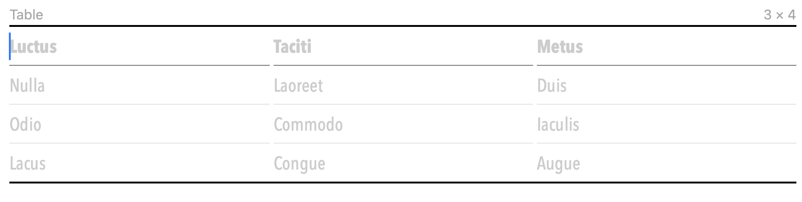
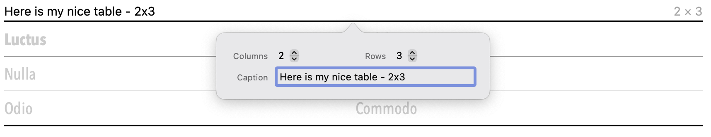
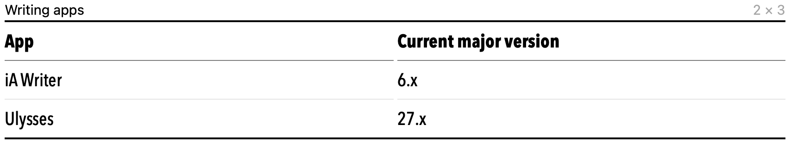

**Important note, 2022-06-22**: I made some errors herein that I have now fixed, as noted in a [subsequent post](/posts/2022/06/ulysses-27-correction/).
{.box}

June, 2022, has turned out to be a big month for the writing apps to which I most frequently turn, [iA Writer](https://ia.net/writer) and [Ulysses](https://ulysses.app). Both reached new major versions and added some long-awaited features.

## iA Writer 6

iA Writer 6 was released June 14 for macOS, iOS, and iPadOS.[^OSIA6] This version added *wikilinks* functionality, as [Lorenzo Gravina](https://twitter.com/loregrav)’s video demonstrates:

[^OSIA6]: I assume other supported OSs will get similarly major updates down the line.



*(After having spent the last three-and-a-half years using iA Writer, I agree with him about those key shortcuts that moved, but them’s the breaks.)*

In addition to what Gravina described, the [official release announcement](https://ia.net/topics/ia-writer-6-now-with-lasers) mentioned these enhancements:

- Preview mode in iPadOS (previously only in macOS and Windows).
- More keyboard- and keypad-based access to commands and features.
- More choices for highlighting text.
- More cross-OS visual consistency.

And, in case you're curious: no, iA Writer 6 *still* limits you to the same three display fonts as did iA Writer 5. Some things never change.

## Ulysses 27

As for Ulysses 27 --- released June 20 for macOS, iOS, and iPadOS --- its main addition is *tables*. And, yes, the Markdown it exports[^MDXL] for tables does work perfectly well with [static site generators](https://jamstack.org/generators) (SSGs), as you'll see in a bit. To create a table in Ulysses 27, you either use the main menu or type `(tbl)` in the editor. A default table appears:

[^MDXL]: The export is from Ulysses's proprietary Markdown XL in the default Ulysses use of iCloud-based "sheets," as its docs are called. However, Ulysses also lets you create *standard* Markdown files in separate, "external" folders, and any tables you create in such Ulysses files also will work as described in this post.



Click/tap this to get an overlay that lets you control how many rows and columns it’ll have, as well as any caption you want to give it:



After I refine it down to a two-column, three-row table, here’s how it looks in the Ulysses editor with my chosen edits:



And this is the Markdown it exports (I changed my mind and cleared the *Caption* entry, which otherwise would’ve appeared within the table):

```md
| App       | Current major version |
| --------- | --------------------- |
| iA Writer | 6.x                   |
| Ulysses   | 27.x                  |
```

Finally, here’s how this site’s SSG renders that Markdown:

| App       | Current major version |
| --------- | --------------------- |
| iA Writer | 6.x                   |
| Ulysses   | 27.x                  |
{.ulysses}

*(Of course, I added some styling to make it look better, since the basic Markdown gives you equally basic HTML with no styling other than your browser’s defaults.)*

Based on what I see in the Ulysses 27 [release notes](https://ulysses.app/release-notes/), the new tables feature offers considerably more options than this simple example would suggest, but you get the idea.

## Dollars and cents

iA Writer 6 currently is a free upgrade if you already own iA Writer 5, while a new owner pays [$49.99](https://ia.net/pricing). I was pleasantly surprised by the free upgrade, given that a major version upgrade for a non-subscription app typically isn't free.

Ulysses is a subscription[^proWriting] app, so Ulysses 27 obviously comes with that. New Ulysses subscriptions are [$49.99/year or $5.99/month](https://ulysses.app/pricing/). In my case, I'm still paying my original $39.99/year rate from 2018. Whether that'll get upped the next time around is something I'll have to wait another year to learn, since I just renewed for another year's worth.

[^proWriting]: To those who involuntarily jeer, "Boo, all subs suck," whenever someone mentions Ulysses: just know that, when others pay me to create content for their websites, I use Ulysses for that writing. It has thus paid for itself many times over and well into the future.
