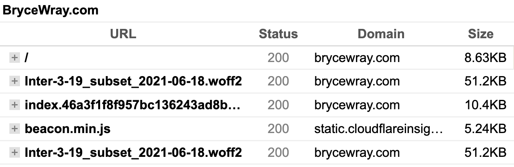

**Note**: Please see the **Updates** at the end.
{.box}

One thing you'll often see explained on the web is that, if you [preload](https://developer.mozilla.org/en-US/docs/Web/HTML/Link_types/preload) a web font to enhance your site's performance, [the `preload` statement must include `crossorigin`](https://developer.mozilla.org/en-US/docs/Web/HTML/Link_types/preload#cors-enabled_fetches) or the font will be double-downloaded.

But what if you include `crossorigin` and the font **still** is downloaded twice?

That's an oddity I've been experiencing, and I hope somebody reading this will have the answer; because, for days, I've tried in vain to figure this out. Given the following HTML (formatted here for easier reading):

```html
<link
	rel="preload"
	as="font"
	href="/fonts/Inter-3-19_subset_2021-06-18.woff2"
	type="font/woff2"
	crossorigin
/>
<link
	rel="preload"
	as="style"
	href="/css/index.eadfd90b48f7358048ed511345ff6b9a.css"
/>
<link
	rel="stylesheet"
	href="/css/index.eadfd90b48f7358048ed511345ff6b9a.css"
	type="text/css"
/>
```

. . . and the following within the CSS:

```css
@font-face {
	font-family: 'Inter';
	font-weight: 1 999;
	font-style: normal;
	font-display: swap;
	src: url('/fonts/Inter-3-19_subset_2021-06-18.woff2') format('woff2-variations'), url('/fonts/Inter-3-19_subset_2021-06-18.woff2') format('woff2');
	unicode-range: U+0000-00FF, U+0131, U+0152-0153, U+02BB-02BC, U+02C6, U+02DA, U+02DC, U+2000-206F, U+2074, U+20AC, U+2122, U+2191, U+2193, U+2212, U+2215, U+FEFF, U+FFFD;
}
```

. . . I don't understand why I get this result (this is a "waterfall" from [GTmetrix](https://gtmetrix.com)):



. . . which shows that the `woff2` font file is loaded twice.

(And I've tried different fonts, each of which double-loads when I employ similar code, so it's not anything about the specific font file shown above.)

Help, please?? Thanks in advance.

----

## Updates, 2022-09-18

- In the initial publication of this post, I neglected to mention that, specifically due to the problem described herein, the site **at that time *didn't*** use web fonts --- so I apologize to anyone who went looking through the source code for them while trying to answer my question.
- It now appears this issue is specific to the site's current host, [Cloudflare Pages](https://pages.cloudflare.com). However, I will leave this post in place for the sake of [transparency](/posts/2019/10/otoh/).

## Update, 2022-09-27

`@MichaelM` informed me today on the Cloudflare Developers Discord's `pages-general` channel that this issue is a Cloudflare Pages bug which actually *strips out* the `crossorigin` from the HTML content, thus causing a mismatch between the `link` header and the actual font request, upon which a browser "will complain and make an additional request" --- hence, the double-loading. He also gave me a workaround that I've since implemented successfully: providing the `preload` through CFP's available [method for attaching headers](https://developers.cloudflare.com/pages/platform/headers/). Thank you, sir!

## Update, 2022-10-10

This issue is now resolved. Learned today on that same Discord channel that the fix has been released to production, and I was able to confirm it for my own site by (a.) restoring the previous `preload`-through-`link` method and (b.) removing the headers-based workaround I mentioned above.
