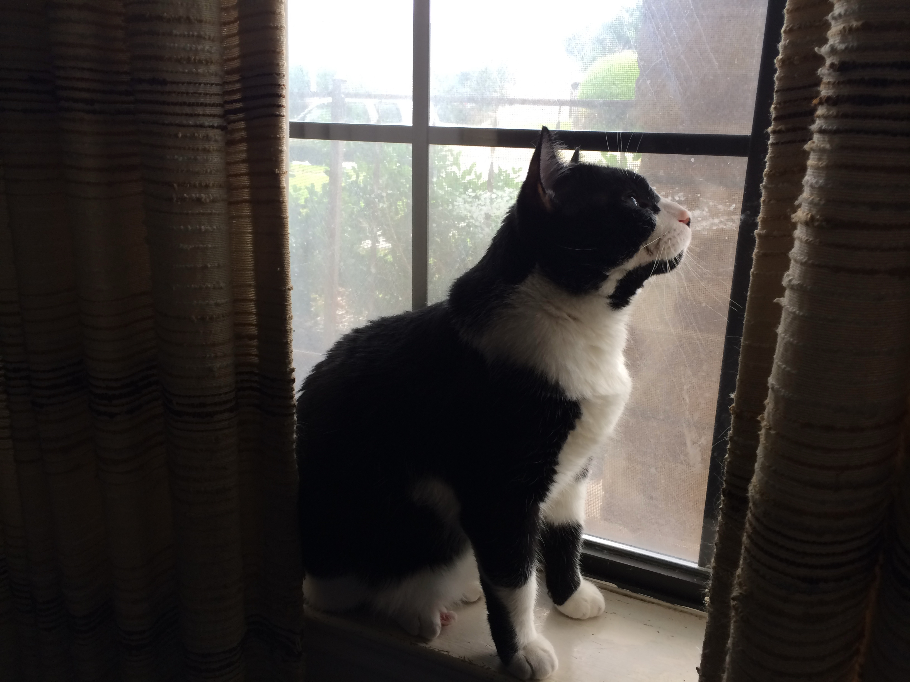

It's understandable that a reader of my various posts about image processing in [Hugo](https://gohugo.io), including the [most recent](/posts/2023/04/better-code-image-processing-hugo), might get the idea that the only way to bring processed images into a Hugo content file is to use a [shortcode](https://gohugo.io/templates/shortcode-templates/). Fortunately, that definitely is *not* the case, thanks to Hugo's *[Markdown render hooks](https://gohugo.io/templates/render-hooks/)*.

<!--more-->

In software development, a *hook* is a function that, as the name implies, lets you "hook into" other code, often to override that code's usual results. More specifically, Hugo's Markdown render hooks are templates which "hook into" [standard Markdown syntax](https://daringfireball.net/projects/markdown/syntax). This post is about the render hook for *images*.

As you may know, Markdown's syntax for displaying images is fairly simple, involving only two required attributes and one optional one:

```md

```

So here's a practical example. Let's say your Hugo project has a post, "My Cat," in the form of a Markdown file called `my-cat.md`. In the same folder as that Markdown file, you've placed an image file, `my-pet-cat.jpg`. (Putting it there makes it a [page resource](https://gohugo.io/content-management/page-resources/) for processing by [Hugo Pipes](https://gohugo.io/hugo-pipes/introduction/); more on that shortly.) Thus, you could use the following Markdown to insert the image in the post:

```md

```

. . . as opposed to how you'd do it with [my image-processing shortcode](/posts/2023/04/better-code-image-processing-hugo/)[^commentsGo]:

[^commentsGo]: If you happen upon this site's repo out of curiosity and check out this post's Markdown file, you'll notice that this example's curly-bracketed boundaries also have wrapping `/*` and `*/`, respectively. That's because, otherwise, Hugo sees it as *real* code, not just a representation of it, and acts accordingly --- in this case, once again displaying the image. See "[Highlight Hugo/GO Template Code](https://gohugo.io/content-management/syntax-highlighting/#highlight-hugogo-template-code)" in the Hugo documentation.

```go-html-template

```

Is that a *lot* more typing? Not really. But:

- What if you have a lot of existing Markdown files where you've already used the much simpler syntax, and you don't want to change them out with shortcodes just to achieve image processing?
- For that matter, what if you've used the simpler syntax for years and *prefer* it, if only for the sake of muscle memory?
- Also, your editor app may well "understand" the simple syntax and be able to display its results in a preview window (as is the case with [iA Writer](https://ia.net/writer), for example) --- a handy capability that obviously won't work with a Hugo shortcode, which such an editor will regard as just gibberish.
- At the very least, when you're coding, your editor app may helpfully auto-complete the Markdown syntax for you; it obviously can't do that for a Hugo shortcode.

The fix for all of this is a render hook --- specifically, a `render-image` template --- that's built to do *nearly* everything the shortcode can do. I say "nearly" because the `render-image` template can accept only a limited number of parameters from the Markdown source. That means that, in building the template, we must pass up the shortcode's ability to accept a few additional parameters and, instead, hard-code some defaults that likely will suffice for nearly all images.

Below is a `render-image` template which provides all the truly important advantages of the shortcode, plus one more of its own:

- Responsive images.
- Gradient image placeholders, **if** used with the `head-imgs-css.html` partial template (or similar templating of your own) I [described previously](/posts/2023/04/better-code-image-processing-hugo/).
- Specific to this shortcode, an optional **caption**, using the optional `title` attribute.

<strong class="red">Important</strong>: Keep in mind that this template assumes the image file is always in the same folder as the Markdown file that's referring to it, allowing the image file to be used as a **page resource**. As for why I encourage that approach, see "[Bundling up: rebuilding my Hugo site](/posts/2022/07/bundling-up-rebuilding-my-hugo-site/)."
{.box}

You must save the template, with the *required* name of `render-image.html`, into the appropriate location as explained in the [documentation](https://gohugo.io/templates/render-hooks/). To make it work throughout the site, put it in `layouts/_default/_markup/`.


{{- $respSizes := slice "320" "640" "960" "1280" "1600" "1920" -}}
{{- $src := .Page.Resources.GetMatch (.Destination) -}}
{{- $alt := .Text -}}
{{- $caption := .Title -}}
{{- $holder := "GIP" -}}
{{- $hint := "photo" -}}
{{- $filter := "box" -}}
{{/*
	The `$holder` variable (placeholder) assumes the
	use of the `head-imgs-css.html` partial
	template (or similar code); so edit
	as may be appropriate for your own site.
	As for the `$hint` and `$filter` items from
	the shortcode, we have no way to `get` them
	from the Markdown syntax's attributes so,
	instead, we set their default values.
*/}}
{{- $imgBd5 := md5 $src -}}
{{- $divClass := print "relative bg-center imgB-" $imgBd5 "-" $holder -}}
{{- $imgClass := "w-full h-auto animate-fade" -}}
{{- $dataSzes := "(min-width: 1024px) 100vw, 50vw" -}}
{{- $actualImg := $src.Resize (print "640x jpg " $filter) -}}
<div class="{{ $divClass }}">
	<picture>
		<source type="image/webp" srcset="
		{{- with $respSizes -}}
			{{- range $i, $e := . -}}
				{{- if ge $src.Width . -}}
					{{- if $i }}, {{ end -}}{{- ($src.Resize (print . "x webp " $hint " " $filter) ).RelPermalink }} {{ . }}w
				{{- end -}}
			{{- end -}}
		{{- end -}}" sizes="{{ $dataSzes }}" />
		<source type="image/jpeg" srcset="
		{{- with $respSizes -}}
			{{- range $i, $e := . -}}
				{{- if ge $src.Width . -}}
					{{- if $i }}, {{ end -}}{{- ($src.Resize (print . "x jpg " $filter) ).RelPermalink }} {{ . }}w
				{{- end -}}
			{{- end -}}
		{{- end -}}" sizes="{{ $dataSzes }}" />
		
	</picture>
</div>
{{- with $caption -}}<p class="imghCaption">{{ $caption | $.Page.RenderString }}</p>{{- end }}


If you want the styling mentioned in the code (including for the optional caption), here's CSS you can drop into your own CSS or Sass files:

```css
.relative {
	position: relative;
}
.bg-center {
	background-position: center;
}
.w-full {
	width: 100%;
}
.h-auto {
	height: auto;
}
@keyframes fadeIn {
 0% {
	 opacity: 0;
 }
 to {
	 opacity: 1;
 }
}
.animate-fade {
	animation: fadeIn 750ms ease-in-out;
}
.imghCaption {
	padding: 0;
	margin-block-start: 0.5em;
	line-height: 1.375;
	font-size: 0.75em;
	text-align: center;
}
```

I like this alternative so much that I've switched to it, away from the shortcode, for nearly all of the site's images --- essentially, all but the very few which need any of the extra settings allowed by the shortcode. Thus, I'll close by inserting a captioned photo of *our* family's cat, via the following Markdown:

```md

```

. . . which produces:


**Note**: In case you use your browser Inspector tool on the HTML from that image, be advised that I coded this site's `render-image.html` template to use Hugo's `MitchellNetravali` filter rather than the Hugo default of `box`.
{.box}

## References and related reading

- Hugo documentation, "[Markdown Render Hooks](https://gohugo.io/templates/render-hooks/)" (last updated <span class="nobrk">2023-04-01</span>).
- React documentation (legacy), "[Hooks at a Glance](https://legacy.reactjs.org/docs/hooks-overview.html)" (last updated <span class="nobrk">2023-03-18</span>).
- "Alligator.io," "[How to Add Images in Markdown](https://www.digitalocean.com/community/tutorials/markdown-markdown-images)" (last updated <span class="nobrk">2020-10-12</span>).
- Matt Cone, *Markdown Guide* website, "[Basic Syntax](https://www.markdownguide.org/basic-syntax/)" (last updated <span class="nobrk">2023-04-22</span>).
- John Gruber, *Daring Fireball* website, "[Markdown: Syntax](https://daringfireball.net/projects/markdown/syntax)" (date unknown).
- Joe Mooring, *Veriphor* website, "[Link and image render hooks](https://www.veriphor.com/articles/link-and-image-render-hooks/)" (<span class="nobrk">2022-12-26</span>).
