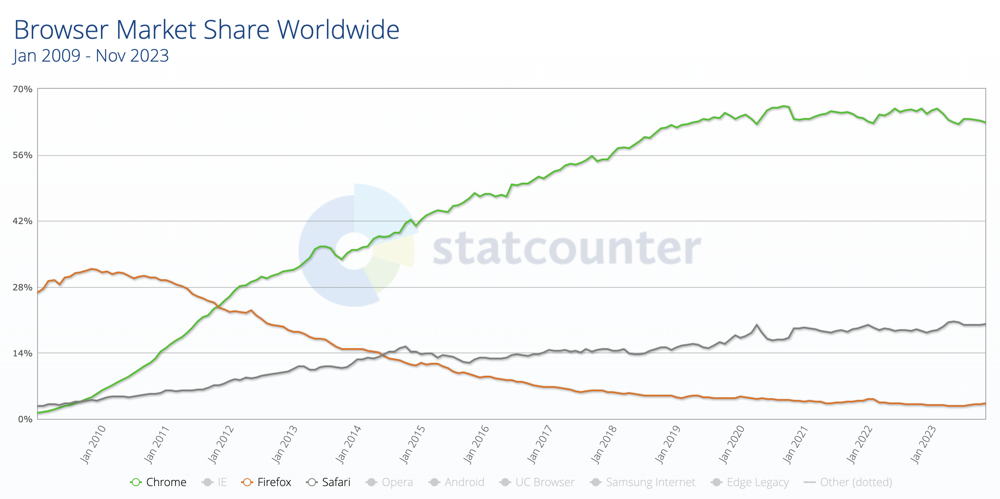

A somewhat obscure guideline for developers of U.S. government websites may be about to accelerate the long, sad decline of Mozilla's Firefox browser. There already are plenty of large entities, both public and private, whose websites lack proper support for Firefox; and that will get only worse in the near future, because the ’fox's auburn paws are perilously close to the lip of the proverbial slippery slope.

<!--more-->

The [U.S. Web Design System](https://designsystem.digital.gov) (USWDS) provides a comprehensive set of standards which guide those who build the U.S. government's many websites. Its  [documentation for developers](https://designsystem.digital.gov/documentation/developers/) borrows a "2% rule" from its [British counterpart](https://www.gov.uk/government/organisations/government-digital-service):

> . . . we officially support any browser above 2% usage as observed by [analytics.usa.gov](https://analytics.usa.gov/).

At this writing, that analytics page shows the following browser traffic for the previous ninety days:

| Browser | Share |
|---|---|
| Chrome | 49% |
| Safari | 34.8% |
| Edge | 8.4% |
| Firefox | 2.2% |
| Safari (in-app) | 1.9% |
| Samsung Internet | 1.6% |
| Android Webview | 1% |
| Other | 1% |
{.ulysses}

I am personally unaware of any serious reason to believe that Firefox's numbers will improve soon. Indeed, for the web as a whole, they've been declining consistently for years, as this chart shows:

Chrome *vs.* Firefox *vs.* Safari for January, 2009, through November, 2023.\
Image: [StatCounter](https://gs.statcounter.com/).
{.imgCaption}

Firefox peaked at 31.82% in November, 2009 --- and then began its long slide in almost direct proportion to the rise of Chrome. The latter shot from 1.37% use in January, 2009, to its own peak of 66.34% in September, 2020, since falling back to a "measly" 62.85% in the very latest data.[^UserActivity]

[^UserActivity]: For that matter, there's also [Mozilla's own "User Activity" chart](https://data.firefox.com/dashboard/user-activity), which shows the count of active Firefox clients dropping from 244.2 million on December 30, 2018, to 187.3 million on November 19, 2023. That's a 23.3% drop over just that five-year period.

While these numbers reflect worldwide trends, the U.S.-specific picture isn't really better. In fact, because the iPhone is so popular in the U.S. --- which is obvious from what you see on that aforementioned government analytics page --- Safari pulls large numbers that also hurt Firefox.

In my days in tech marketing, we used to worry about how a dominant competitor would take "shelf space" in those large stores where we wanted visibility for our goods and their accompanying point-of-purchase brochures. (Remember point-of-purchase literature, fellow oldsters?) Well, Firefox is quickly losing "web space," thanks to a perfect storm that's been kicked up by the dominance of Chrome, the popularity of mobile devices that run Safari by default, and many corporate and government IT shops' insistence that their users rely on only Microsoft's Chromium-based Edge browser while toiling away each day.

With such a continuing free-fall, Firefox is inevitably nearing the point where USWDS will remove it, like Internet Explorer before it, from the list of supported browsers.

"So what?" you may wonder. "That's just for web developers in the U.S. government. It doesn't affect any other web devs."

Actually, it very well could. Here's how I envision the dominoes falling:

1. Once Firefox slips below the 2% threshold in the government's visitor analytics, USWDS tells government web devs they don't have to support Firefox anymore.
2. When that word gets out, it spreads quickly to not only the front-end dev community but also the corporate IT departments for whom some web devs work. Many corporations do a lot of business with the government and, thus, whatever the government does from an IT standpoint is going to influence what corporations do.
3. Corporations see this change as an opportunity to lower dev costs and delivery times, in that it provides an excuse to remove *some* testing (and, in rare cases, specific coding) from their development workflow.[^companiesFF]

[^companiesFF]: At least, this is in the case of those companies which did still bother to test their websites on Firefox in the first place. More than a few gave up on it some years ago, if my own anecdotal experiences can provide any guidance.

. . . and just like that, in less time than you might think, Firefox --- the free/open-source browser that was supposed to save the world from the jackboots of Internet Explorer (which had killed Firefox's ancestor, Netscape Navigator) --- is reduced to permanent status as a shrinking part of the fractured miscellany that litters the bottom of browser market-share charts.

I surely hope I'm wrong about this, but I fear I'm not.

----

Nearly five years ago, as the news broke that Microsoft had decided to move its Edge browser to the Blink engine that also powers Google Chrome, I [wrote](/posts/2018/12/on-edge/):

> Supporting multiple browser engines --- even if there is a Really Big Dog engine among them that's about to get even bigger --- ain't always fun, but it goes with the territory; and I firmly believe it will continue to do so, especially for sites that are commercial in nature.

That firm belief remains unchanged, but the meaning of the "multiple browser engines" part is in serious danger of significant change. Unless something dramatically reverses Firefox's trends, the ’fox could soon be whimpering its way down an ugly, slippery slope to irrelevance.
