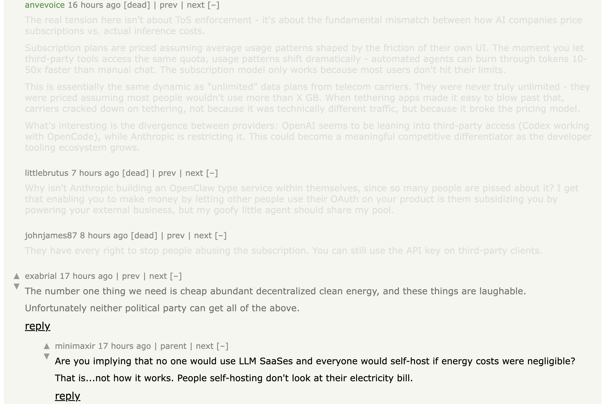
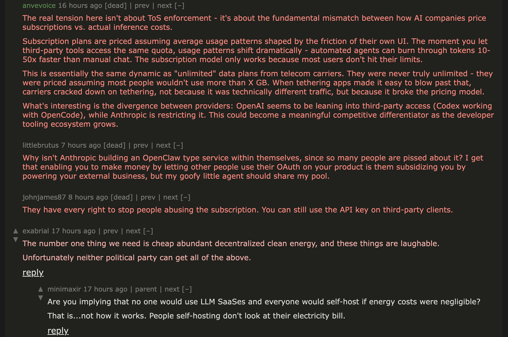

If you spend lots of hours per week perusing content on one or more web browsers as I've been doing since, oh, the mid-1990s, there are ways you can tailor that activity somewhat more to your liking. Many of you probably already know about the potential solutions I'll mention in this post but, on the off-chance that you don't, here are some tips for improving your browsing experience. Specifically, this is about: (1.) adjusting how the browsers actually render web pages; and (2.) filtering out ads and certain other content types that interfere with one's browsing pleasure. To be sure, there's a certain degree of interaction between those two, but I've found that they require two different sets of solutions.

*(This is almost entirely about browsing from a computer, not from within a phone or tablet, particularly since the vast majority of my readers still view my content from their computers rather than their other devices. However, I still will have a few comments about browsing with the latter.)*

<!--more-->

## Controlling appearances

A few months ago, I noticed that I was constantly editing certain sites' CSS in the browser Inspector because, more and more, the sites' default styles were unkind to my aging eyes. Hacker News is a particularly onerous offender in this regard. For example, HN's default shows sharply downrated comments in so light a gray color --- on top of a very light tan background, to boot --- that they're almost illegible to me. (While I often agree that such a comment **deserves** its bad numbers, I still want at least to see what it said.) In addition, given the lighting conditions in my usual spot for viewing HN content, I prefer to see it in dark mode; but HN's default styling doesn't "respect" one's dark- or light-mode settings. To paraphrase [an already often-paraphrased Henry Ford quote](https://www.gardnerweb.com/articles/henry-ford-is-still-right-when-it-comes-to-color), "You can have any mode you want, as long as it's light."

That kind of manual, *page-by-page* editing gets old fast, especially when you're doing it many times a day; and HN isn't the only such trouble spot for me. So, I soon realized, a better solution would do it in a way that works every time I go to a site. That led me to the [open-source Stylus browser extension](https://github.com/openstyles/stylus) for Chrome- and Firefox-compatible browsers. It automatically loads site-specific CSS, rather than my making manual edits every page visit.[^FireFoxUserContent]
 
[^FireFoxUserContent]: If you use only Firefox-compatible browsers, you can do this by creating and editing a `userContent.css` file. That method certainly has its adherents, but I prefer using an extension like Stylus rather than maintaining a local file, especially since [Mozilla long ago put the use of that file behind a flag](https://bugzilla.mozilla.org/show_bug.cgi?id=1541233) and could kill it at any time.

The interest in doing this sort of thing isn't new, of course. Back in the early days of Firefox's existence, We Of A Certain Age would use an extension called [Greasemonkey](https://github.com/greasemonkey/greasemonkey) which, I was delighted to see when researching for this post, is still around, although it and Firefox certainly aren't nearly as popular as each once was. It allows customization of not only a web page's appearance but also its functionality. [Greasemonkey's wiki](https://wiki.greasespot.net/Main_Page) is probably the best place to go if you need a better explanation.

Where changing only a page's CSS is the intended result, there've been other notable extensions over the years:

- The venerable [Stylish](https://userstyles.org/) began [in 2005](https://web.archive.org/web/20051210042217/http://forums.mozillazine.org/viewtopic.php?t=327735) as an open-source project, but was acquired in 2017 by an advertising analytics company. As can sometimes result unfortunately from that type of acquisition, Stylist since has become infamous for significant privacy violations (*e.g.*, see [this 2018 article](https://robertheaton.com/2018/07/02/stylish-browser-extension-steals-your-internet-history/)). Even to this day, more than a few reviewers flatly call it "spyware" and downrate it severely. You can do better than Stylish.
- [Stylebot](https://stylebot.dev/) used to be one of the favorites for this sort of thing, but it hasn't had a new release **on its repo** since [v.3.0.1 appeared 2020-07-29](https://github.com/ankit/stylebot/releases). As of this writing, Stylebot's Chrome extension is at v3.1.4 from 2024-05-17 and its Firefox extension is at v.3.1.3 from 2024-07-24; I'm thus presuming anything newer than v.3.0.1 is closed-source.

By contrast, Stylus is still actively developed and open-source, so it's the choice I recommend.

With Stylus, I can change the appearance of Hacker News from this:



. . . to this:



**Note**: I use browsers' zoom functions to view each HN page at higher magnification because, as I said, my eyes are old. I find the default text size on many web pages to be unacceptably small and, when I inspect their CSS, what I find leads me to believe they were designed by young folks for whom It Looks OK To Them. I was inveighing against such short-sightedness [years ago](/posts/2018/10/web-typography-part-1/), even before my eyes needed as much help as they now do.
{.box}

In case you'd find it useful, here's the CSS I use with Stylus to view Hacker News content that way:

```css
html {
  filter: invert(90%) hue-rotate(180deg);
  background: #fff;
  /* For viewing ALWAYS in dark mode */
  /* h/t to https://news.ycombinator.com/item?id=46663782 */
}

table.fatitem p, 
table.fatitem .toptext {
  color: #000;
}

div div a, div p a {
  color: #00008b;
}

div.commtext.c5A {
  color: #5a0000;
}

div.commtext.c73 {
  color: #730000;
}

div.commtext.c88 {
  color: #880000;
}

div.commtext.c9C {
  color: #9c0000;
}

div.commtext.cAE {
  color: #ae0000;
}

div.commtext.cBE {
  color: #be0000;
}

div.commtext.cCE {
  color: #ce0000;
}

div.commtext.cDD {
  color: #dd0000;
}

div.commtext.c00 a {
  color: #00008b;
}

div.commtext.c5A a,
div.commtext.c73 a,
div.commtext.c88 a,
div.commtext.c9C a,
div.commtext.cAE a,
div.commtext.cBE a, 
div.commtext.cCE a, 
div.commtext.cDD a {
  color: #8b0000;
}

div.commtext.c5A a:visited,
div.commtext.c73 a:visited,
div.commtext.c88 a:visited,
div.commtext.c9C a:visited,
div.commtext.cAE a:visited,
div.commtext.cBE a:visited, 
div.commtext.cCE a:visited, 
div.commtext.cDD a:visited,
div.commtext.c00 a:visited {
  color: #8b008b;
}

div div pre {
  color: #006400;
}
```

Where Apple's WebKit-based Safari browser is concerned, the outlook is more grim: there is no Stylus extension  for Safari, for which [third-party extension availability is much more limited](https://www.howtogeek.com/safari-is-missing-your-favorite-extensions/).[^StylusOnSafari] The closed-source, paid [Cascadea](https://apps.apple.com/us/app/cascadea/id1432182561?mt=12) extension for Safari on macOS would *seem* to provide similar capabilities (I haven't tried it), but its last update was apparently 2021-11-02.

[^StylusOnSafari]: Many years ago, even the now-tarnished Stylish had a Safari version!

If you're on macOS and prefer to avoid Chrome- and Firefox-compatible browsers, there *may* be another possibility. The [Orion](https://orionbrowser.com/) browser, also based on WebKit, actually allows the enabling of extensions built for Chrome and Firefox, although many such extensions' actual in-Orion performance remains problematic at this writing. You can *try* using an older version of the Stylus extension for Chrome --- I got it to work on Orion with v.1.5.51 --- since anything newer apparently isn't compatible with Orion. It's possible to *install* the current Stylus version, but its functionality is broken in Orion.

## Blocking ads

Obviously, the existence of most content I follow on the web depends to some extent on advertising dollars. Still, there's a lot of problems with how some ads are delivered on the web these days, right down to the [inclusion of out-and-out malware](https://www.securityweek.com/fbi-recommends-ad-blockers-cybercriminals-impersonate-brands-search-engine-ads/) in more than a few cases; so I choose to perform whatever ad-blocking I can. Besides, there are hundreds of millions of young folks out there using their totally non-ad-blocked phones to cruise the InterWebz, so I'm sure old goats such as I are no longer that important to the poor, oppressed advertisers. They won't miss me. I surely don't miss them.

As with the CSS-editing stuff I described earlier, my approach to blocking ads is *mostly* extension-based. The best ad-blocker out there is [Raymond Hill](https://github.com/gorhill)'s superb open-source extension, [uBlock Origin](https://github.com/uBlockOrigin). Although uBO [has always worked best on Firefox](https://github.com/gorhill/uBlock/wiki/uBlock-Origin-works-best-on-Firefox), it also was a must-install on Chrome until 2024. That's when Google began implementing its [Manifest V3 extension platform](https://developer.chrome.com/docs/extensions/develop/migrate/what-is-mv3) which, combined with similar developments in other browsers (some earlier, as in the case of Safari), [neutered how uBO works](https://github.com/uBlockOrigin/uBlock-issues/wiki/About-Google-Chrome's-%22This-extension-may-soon-no-longer-be-supported%22) due to the blocking of certain network requests upon which uBO's blocking and filtering depends.  As a result, Hill came up with the Manifest V3-compatible (and therefore more limited) [uBlock Origin Lite](https://github.com/uBlockOrigin/uBOL-home) for Chrome-compatible browsers and, more recently, Safari. In my own use cases, uBOL works better than a lot of people think and certainly is better than no ad-blocker at all on those browsers, although it surely doesn't "catch" as much as the real uBO still does in Firefox.

For fans of Chrome-compatible browsers, the Brave browser gives you nearly uBO-like ad-blocking and content-filtering through its built-in, Rust-powered [Brave Shields](https://brave.com/shields/) feature, some settings for which --- notably, its [filter lists](https://support.brave.app/hc/en-us/articles/6449369961741-How-do-I-manage-adblock-filters-in-Brave) --- are largely compatible with similar settings for uBO and certain other blockers, such as [AdBlock](https://getadblock.com/en/). (As you've probably read elsewhere, Brave *does* still support full-fledged uBO, at least for now, **but** the widespread advice is not to use both Brave Shields and uBO together; the former is sufficient.)

As mentioned above, the Orion browser on macOS allows use of some extensions from the respective Chrome and Firefox web stores; and, as of this writing, the full-fledged uBO extension for Firefox still works with Orion. How long that will still be true (*i.e.*, whether a Manifest V3-like situation catches up with Orion at some point) remains to be seen.

Where Safari is concerned, there are two other possibilities you can try, each of which is free/open-source and works by performing ad-blocking and content-filtering at the device level, rather than the browser level:

- [wBlock](https://github.com/0xCUB3/wBlock) is available for macOS, iOS, and iPadOS. Its [feature comparison chart](https://github.com/0xCUB3/wBlock/blob/main/Adblock_Comparison.md#feature-comparison) lets you see how it stacks up against several other, better-known ad-blocking solutions for Safari, including uBOL. By being a device-level ad-blocker rather than a browser extension, it avoids the limitations that would hamper a uBO-like blocker while working --- at least, in my own observations over the last few weeks --- quite well on all my Apple devices. If Safari is a sufficient browsing experience for you, I can recommend wBlock quite highly. (For just one example: before I installed wBlock, I found it unbearable to view Reddit on Safari.)
- [Zen](https://github.com/ZenPrivacy/zen-desktop), which probably should be called something else so it's easier to find in a web search (since there's already a popular Firefox fork called Zen), is available for macOS as well as Windows and Linux; to my knowledge, there's no mobile version at this time. It blocks ads and the like from *all* browsers, not just Safari as is the case with wBlock. While I found Zen to be competent enough --- *e.g.*, it blocks more from Chrome than uBOL does --- it also seems to have some technical quirks that made me stop using it after a few days of testing. One glitch that bugged me in particular was that it seems to interfere with certain HTTP requests in such a way that HTTP/3 content was dropped down to HTTP/1.1. (Yeah, [I do care about that sort of thing](/posts/2025/10/getting-http3-cloudflare-firefox/).) Still, it's a fairly young project compared to others in this genre, so perhaps such issues will lessen over time. (I did find some online comments lamenting Zen's requirement to install a local root certificate; while its documentation does [explain this rather fully](https://github.com/ZenPrivacy/zen-desktop/blob/master/docs/internal/security-architecture.md), some individuals fully "noped out" of it over just that item.)

**Note**: Finally, since I suspect at least one visitor will wonder about it . . . yes, I do know about [router-level ad-blocking](https://www.zdnet.com/article/sick-of-online-ads-and-trackers-how-i-block-them-across-my-entire-home-network/), but it simply involves more futzing than I care to do. I'll tinker with **my** computers, devices, and/or browsers to get desired ad-blocking results, because I'm the only one who will suffer if I err; but I won't Go There where **our** shared TV is concerned. Maybe a twenty-years-younger version of me would've tried something like that, but the 2026 version of me neither cares that much about it nor needs the potential, resulting headaches.
{.box}

----

If you feel any or all of the above suggestions will be more of a hassle than you have either time or patience to handle, don't worry. It simply means you're not as cantankerous as I, and that's probably a good thing. However, if you *are* willing to give these a try, I think you'll like the results. They took a while to get the way I wanted them --- and I'm still making adjustments here and there --- but I've found them quite worth the time and effort. I hope you will, too.
